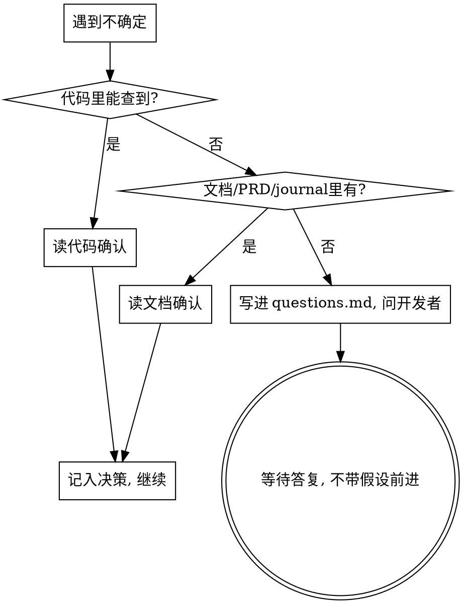

# 实事求是 · 不猜测、不捏造

**核心原则：不清楚的事，绝不靠想象补全。** 任何"应该是/大概/我猜/通常这样"都是危险信号。

## 硬门禁（HARD GATE）

<HARD-GATE>
在写计划、做预演、改代码时，如果你对任何一个事实、行为、接口签名、需求意图、边界条件 **不是 100% 确定**，你必须先把它弄清楚，才能继续。不允许带着未确认的假设往下走。
</HARD-GATE>

## 弄清楚的三条途径（按顺序）

1. **读代码**：能从代码/测试/类型定义确认的，直接确认，引用 `file:line`。
2. **读文档**：项目文档、`docs/sandtable/` 下的 `project.md`/`prd.md`/`journal.md`、README、commit 历史。
3. **问开发者**：前两者都无法确定时，把问题写进该需求的 `questions.md`，并直接向开发者提问。一次问清楚关键问题，不要连环追问也不要憋着不问。

**得到答案后**：把结论写回 `prd.md`/`tests.md`/`plan.md` 对应位置，并在 `journal.md` 追加一条决策记录（谁、何时、决定了什么、依据是什么）。

## 区分"事实"与"假设"

每当你陈述一个支撑决策的事实，标注来源：
- `[已确认: src/foo.ts:42]` — 读代码得到
- `[已确认: prd.md#验收]` — 读文档得到
- `[待开发者确认]` — 还没确认，已记入 questions.md
- 禁止出现没有来源标注的关键判断。

## 合理化对照表（出现即停）

| 借口 | 现实 |
|------|------|
| "应该是这样工作的" | "应该"= 没确认。去读代码。 |
| "通常框架都这么设计" | 这个项目不一定。去确认。 |
| "先按我的理解写，错了再改" | 错误的预演/实现会浪费整轮循环。先确认。 |
| "问开发者太麻烦/会显得我不懂" | 带着错误假设交付才显得不专业。问。 |
| "这个边界情况大概不会发生" | 大概=没验证。要么确认不会，要么处理它。 |
| "PRD 没写，我补一个合理的默认" | 缺失的需求要问，不是自己发明。 |

## 与预演的关系

预演中暴露出的"不确定"是最有价值的发现——它正是要被终止上报的 `ANOMALY`。不要在预演里"猜一个继续跑"，那会让预演失去意义。

## 与预演分级的关系

预演中暴露的"关键未知"是最有价值的发现——会影响 PRD/plan/code reality 闭环、验收或决策的，必须按 `using-sandtable` 的 P0–P3 分级上报（P0/P1 进修正循环）。但**不猜测 ≠ 把无关边缘疑问升级成 anomaly**：与本需求无关、无现实触发路径、不影响验收的疑问记为残余风险（P2/P3），不驱动循环。两头都要守住——既不带着关键假设前进，也不为"逻辑完美"制造伪问题。
