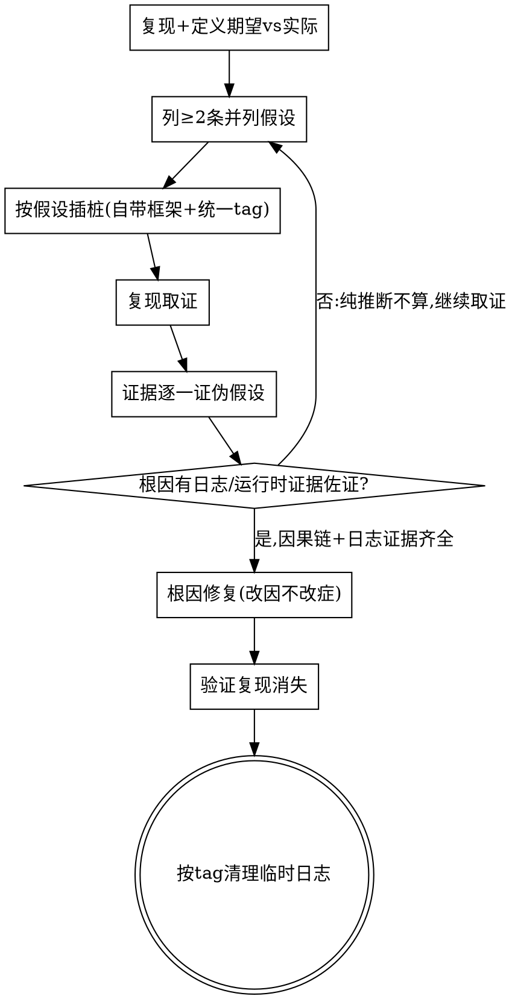

# bugfix 模式 · 证据驱动追根究底，不猜测、不表面修复

**核心立场：bugfix 是 `being-truthful` 在运行期的延伸。** 不靠"我觉得是 X"，靠**可复现的日志/运行时证据**锁定**单一根因**；改因不改症，不留临时绕过。

**开始时声明：** "我在用 bugfix-with-evidence 做证据驱动排障。"

<HARD-GATE>
1. **【最根本】根因必须靠日志/运行时证据 100% 确认**：**只靠读代码推断不得视为已确认根因**；锁定根因必须有日志或运行时证据贯通整条因果链。唯一窄例外：缺陷本质**纯静态可判定**（编译/类型错误、明显笔误）并须说明，且仍优先复现验证。**无日志出路**：日志既不能自动采、用户也给不出、又非纯静态可判定 → **不擅自降级**，置 `blocked=true` 写 `questions.md` 问开发者（补日志手段或由开发者裁决）。
2. **日志框架**：插桩**优先复用工程自带日志框架**（先侦察项目用什么 logger/约定，照搬其入口与风格）；项目确无统一框架时降级到该语言**惯用**日志方式，**禁止裸 `print`/`console.log` 临时输出冒充**（除非项目本就以此为约定，且需说明）。
3. **统一 tag**：本次排障新增的每条日志带统一可 grep 前缀 `[SANDTABLE-BUGFIX:<feature-or-bug-id>]`，便于检索与一键清理。
4. **根因后清理**：根因锁定、修复验证、复现消失后，按 tag 移除本次新增的临时日志；确有长期价值的改为项目正式日志（去 SANDTABLE-BUGFIX 临时 tag）并说明，不残留临时 tag。
5. **禁表面/临时修复**：禁止吞异常(静默 try/catch)、`sleep`/定时器规避时序、注释掉报错、仅改症状文案等；只能临时缓解时须显式标注并要求根因修复跟进。
6. **先自动收集，少打扰用户**：取证前先判断能否由 agent **自动采集**日志，能自动就**不**让用户提供；仅"只有用户能给"时才请用户提供并给现成命令。采集物落**仓库外/临时目录**（系统 temp 或项目外 scratch，**不入 git 仓**，因日志常含密钥/PII），`feedback.md` 只记来源+关键摘录+证据出处（行号/时间戳），**绝不 `git add` 日志原文**、不放进 `docs/sandtable/`、不自动改用户 `.gitignore`。**Sandtable 只发 markdown，不捆绑采集 server/脚本**；临时 sink 在用户项目用其技术栈临时搭、用完即清。
</HARD-GATE>

## 自动收集日志策略（按项目识别选用，优先于让用户提供）

> 落点：采集物一律落**仓库外/临时目录**（记为 `<scratch>`，如 `$TMPDIR/sandtable-logs/<feature>/`），**不入 git 仓**；feedback.md 只记路径+摘录+行号。

| 项目类型/情形 | 自动采集做法（示例） |
|---------------|----------------------|
| Android / 连着设备 | `adb logcat -d > <scratch>/logcat.txt`（可加 `-b crash`/过滤 tag） |
| 有日志文件/目录 | 直接读 / 尾随该文件；相关时间窗摘录到 `<scratch>` |
| 能本地跑复现 | 运行复现并抓 stdout/stderr 到 `<scratch>` |
| 运行时/远程/服务 | 在**用户项目内、用用户技术栈**临时起一个 log sink 收集，纳入临时日志清理 |
| 只有用户能给（设备/生产） | 才请用户提供：指明丢到 `<scratch>`、给现成导出命令（如 `adb bugreport`、打包 `log.zip`） |

## 调查分队（非平凡缺陷：广 + 深 + 发散）

排查思维要**广**（多角度）、**深**（到根因非症状）、**发散**（大胆列假设不过早收敛）。

- 非平凡缺陷（多假设 / 跨子系统 / 难复现）默认派 **≥3 个并行调查子 agent**（与 `red-team-wargame` `min_agents` 一致），各攻一个角度：时序 / 数据流 / 依赖与配置 / 并发 / 状态与生命周期 / 外部 IO。
- **动用沙盘推演武器库**（成员按需采取不同姿态）：
  - **头脑预演（mental-rehearsal）**：只读推演候选因果链是否逻辑闭环。
  - **侦查（gathering-intel）**：系统摸清日志/数据流/依赖的"地形"，列已知与未知。
  - **红军（red-team-wargame）**：派红军**证伪候选根因**——专攻"这真的是根因吗"，攻不破（举不出反例）才算**真根因**。
- **采集集中、子 agent 只读**：日志采集/跑复现/起 sink **由主 agent 集中先做一次**，落 `<scratch>`；调查子 agent 是**只读分析者**（对已采集日志/代码取证），**禁止各自跑复现或起 sink**，避免并行争抢设备/端口/文件、污染证据。
- 每个子 agent 回报**带日志证据**（`file:line` + 日志行）的发现，纯推断不算（HARD-GATE 1）。主 agent **汇总并亲自核实**，锁定**单一根因**，不轻信任一子 agent 的"我觉得"。平凡缺陷（一眼定位）允许单线，不强派。
- 子 agent 派发模版见 `./investigator-prompt.md`。

## 证据驱动闭环

## 根因闸门（出现即不通过）
- **只靠读代码推断、无日志/运行时证据 → 未确认根因，继续取证**（HARD-GATE 1，最根本）。
- 只有"我觉得/应该是"而无 `file:line`+日志证据 → 不下结论。
- 因果链有断点（不能从根因推到观察到的现象）→ 未锁定，继续。
- 修复改的是症状而非根因 → 退回，按 HARD-GATE 5 处理。

## 与 triaging-feedback / being-truthful 的关系
- 多由 `triaging-feedback`（缺陷类）或 `/sandtable-bugfix` 路由进入。
- 任何"不确定"按 `being-truthful` 处理；根因与修复结论回写 `feedback.md`、journal；修复后回 `triaging-feedback` 产出回归用例 + 三件套（根因/预防/教训）。

## Red Flags
| 念头 | 现实 |
|------|------|
| "我读了代码，根因就是这儿" | 读代码不够。根因必须有日志/运行时证据 100% 佐证（HARD-GATE 1）。 |
| "大概是这儿，改了试试" | 没证据=猜。先插桩取证锁根因。 |
| "加个 try/catch 先不报错了" | 吞异常=临时修复，禁止。修根因。 |
| "print 一下看看，回头再删" | 用自带框架+统一 tag，且根因后必须清理。 |
| "症状没了就算修好" | 症状消失≠根因解决。要能讲清因果链。 |
| "一个人顺着想就行" | 思维要广+深+发散；非平凡缺陷派调查分队，红军证伪候选根因。 |
| "日志拿不到就先按推断改了" | 拿不到日志→升级 blocked 问开发者，不擅自降级。 |
