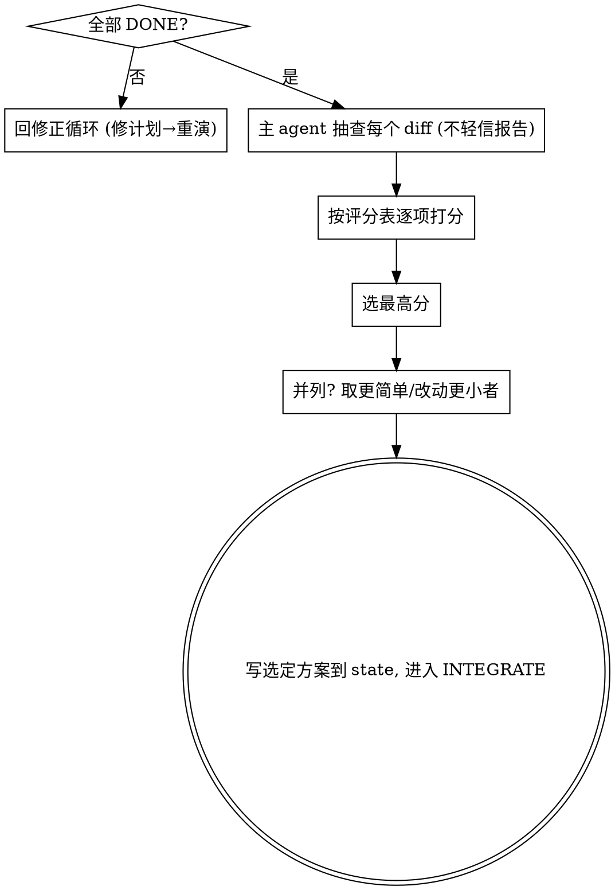

# 预演评分与择优

**核心：当多个实现预演都顺利通过后，用客观标准给每个打分，选分数最高的落地。** 只要还有任一预演是 ANOMALY/BLOCKED，就不进入打分——先回到修正循环。

**开始时声明：** "我在用 evaluating-rehearsals 给预演打分择优。"

## 进入条件（门禁）

<HARD-GATE>
仅当本轮所有实现预演子 agent 都返回 `DONE` 且完整性闸门通过时才打分。闸门必须核对覆盖矩阵、live TODO 表、主 agent 独立结构化基准与真实 diff / 改动文件清单。任一 `ANOMALY_FOUND`/`BLOCKED`、闸门缺失或闸门未通过 → 不打分，回到：主 agent 亲自核实 → 问开发者 → 修正 PRD/计划 → 重演。
</HARD-GATE>

## 流程

主 agent 必须**亲自读每个预演的真实 diff**，不能只看子 agent 的自评报告。

## 评分表（每项 0–5，可按需加权）

| 维度 | 含义 | 权重建议 |
|------|------|---------|
| 需求符合度 | 是否完整满足 PRD 全部功能需求与验收标准 | ×3 |
| 红线符合度 | 是否零违反 MUST / MUST-NOT（含不越界、不兜底） | 一票否决：有违反则淘汰 |
| 正确性证据 | 测试是否真在验证行为、是否全绿、覆盖关键路径 | ×3 |
| 极简度 | 是否最小改动达成目标、无多余抽象/未要求功能（YAGNI） | ×2 |
| 改动外科性 | 是否只动该动的、不动无关代码 | ×2 |
| 可读可维护 | 命名清晰、结构聚焦、易理解 | ×1 |
| 与现有模式契合 | 是否遵循项目既有约定 | ×1 |

> "红线符合度"是一票否决项：违反任一 MUST/MUST-NOT 的预演直接淘汰，无论其他维度多高。

## 择优规则

1. 总分最高者胜出。
2. 分数接近（差距 < 10%）时，取**更简单、改动更小**的那个（Karpathy 极简优先）。
3. 把选定预演的报告路径写入 `state.md` 的 `selected_impl`，phase 置为 `INTEGRATE`，journal 记录打分结果与理由。
4. 未选中的 worktree/分支清理。

## 输出

给开发者一份简短对比：每个预演的总分、关键差异、为何选 X。让开发者有机会推翻（用户指令优先）。

## Red Flags

| 念头 | 现实 |
|------|------|
| "有个预演 BLOCKED，但另一个 DONE，直接用 DONE 的" | 先核实 BLOCKED 是否暴露了计划缺陷，可能影响所有方案。 |
| "看自评分就行，diff 不用细看" | 必须抽查真实 diff，自评可能乐观。 |
| "功能最全的就是最好的" | 越界/过度实现要扣分，极简优先。 |
| "并列就随便选一个" | 取更简单、改动更小者。 |

## 实现预演完整性闸门

**执行完整性闸门时，必须完整读取并逐条遵循 `skills/_shared/integrity-gate.md`（含“闸门必须包含”与“候选 DONE 报告必须包含”全部条目），不得跳过或凭记忆简写。**
