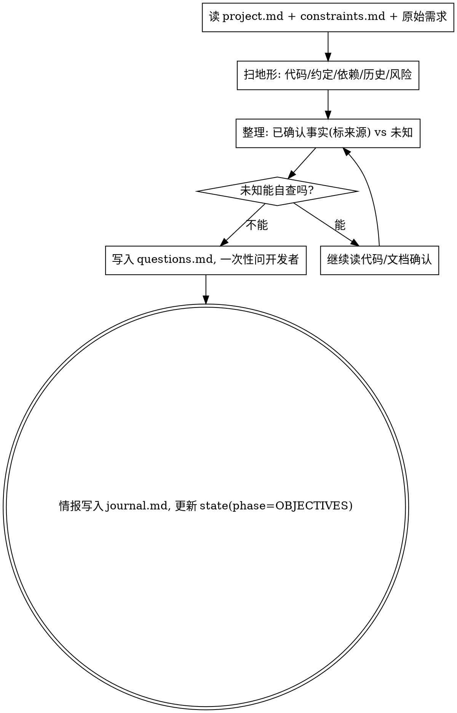

# 情报侦察 · Reconnaissance（摸清地形再用兵）

**军事原则：不侦察就开战是送死。** 在定目标、做计划之前，先主动把战场地形摸清——相关代码怎么跑、有哪些约定、依赖什么、风险在哪、哪些是未知。**情报的产物是"已确认事实"和"必须澄清的未知"两张清单。**

**开始时声明：** "我在用 gathering-intel 做情报侦察。"

## 与 being-truthful 的关系

`being-truthful` 是"遇到不确定时怎么办"的被动门禁；`gathering-intel` 是**主动出击**——在还没遇到具体不确定前，就系统性地把地形扫一遍。两者都禁止猜测。

## 侦察清单（逐项产出，标来源）

1. **地形（相关代码）**：入口、关键模块、数据流、状态存储。每条标 `file:line`。
2. **既有约定**：命名/分层/测试/错误处理的现有模式（照搬，别另立）。
3. **依赖与边界**：会牵动哪些上下游、外部服务、配置。
4. **历史**：相关 commit、`docs/`、`journal.md` 里已有的决策。**若存在** `docs/sandtable/lessons.md` 则必读，把命中的历史教训列为本次侦察检查项（过去的 bug 武装本次推演）。
5. **风险与雷区**：易错点、隐藏耦合、性能/安全敏感处。
6. **未知清单**：所有读代码/读文档都无法确定的点。

## 流程

## 自主提问的纪律

- 问题要**攒成一批一次问清**关键的，不要挤牙膏式连环追问，也不要憋着不问。
- 每个问题写明：为什么阻塞、已尝试的确认途径、可选项（若有）。记入 `questions.md`。
- 大型侦察可派只读子 agent 并行扫不同子系统，最后由你汇总核对。

## 输出

一份**情报简报**写入 `journal.md`：已确认事实清单（带来源）+ 未知/待澄清清单。这是 `objectives` 与 `plan` 的事实地基。

## Red Flags

| 念头 | 现实 |
|------|------|
| "需求挺清楚，直接定目标" | 没侦察就定的目标常基于错误假设。先扫地形。 |
| "这块代码我大概知道怎么跑" | 大概=没确认。读它，标 file:line。 |
| "未知先记着，边做边看" | 关键未知要现在就澄清，否则污染后续每一步。 |
