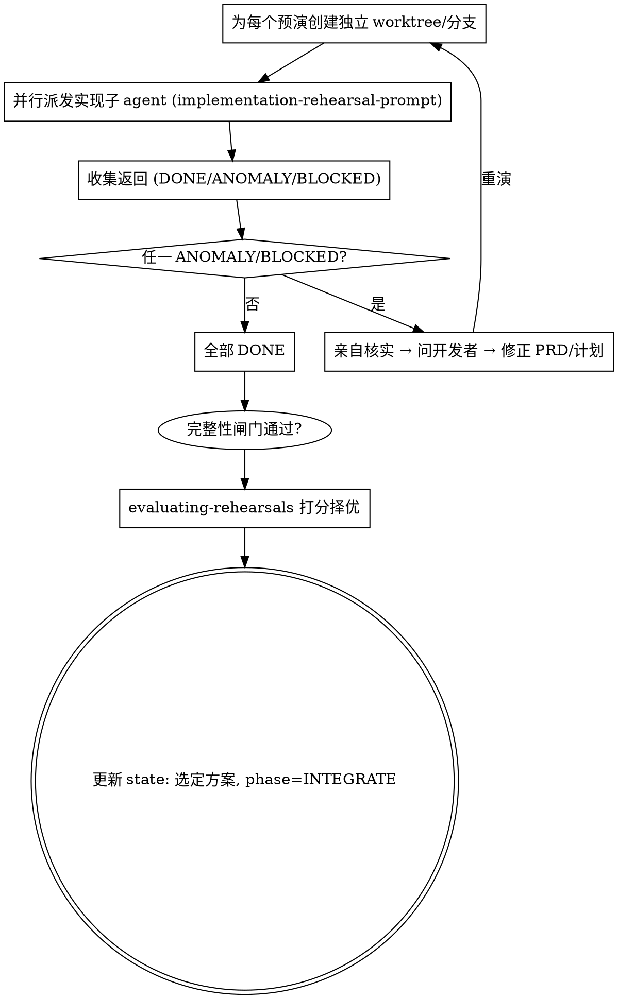

# 实现预演 · 真改代码（隔离 worktree，可并行）

**核心：真正按计划和 PRD 写出完整代码并验证，不留细节。** 头脑预演验证"逻辑想得通"，实现预演验证"代码做得出且行为正确"。这一步是在**隔离工作区**里"试做"，确认无误后再择优落地。

**开始时声明：** "我在用 implementation-rehearsal 做实现预演。"

## 为什么用隔离 worktree + 并行子 agent

- 实现预演会真改代码。多个预演若共用工作区会互相覆盖污染。
- 每个实现预演子 agent 在**独立 git worktree / 分支**里干活，互不影响。
- 可并行派发多个（不同实现思路），最后比较择优——对应你要的"派生多个子 agent 同时预演，选分最高"。

## 两条铁律

1. **子 agent 只要发现与计划不符、意料之外、之前没注意到的事 → 立即停止，返回 `ANOMALY_FOUND`，不要自行改计划继续写。**
2. **完整实现，不留细节**：不允许 TODO、占位、"先这样以后再补"。要么完整做完并通过验证（`DONE`），要么发现问题上报（`ANOMALY_FOUND`），要么确实做不动（`BLOCKED`）。

## 编排（主 agent 做的事）



## 创建隔离 worktree（示例）

```bash
git worktree add ../<repo>-rehearsal-1 -b sandtable/rehearse/<feature>-1
git worktree add ../<repo>-rehearsal-2 -b sandtable/rehearse/<feature>-2
```
把每个子 agent 的工作目录指向对应 worktree。预演结束后，未被选中的 worktree/分支清理掉。

## 异常处理（对齐 superpowers 的状态语义）

| 状态 | 主 agent 动作 |
|------|---------------|
| `DONE` | 收下 diff + 测试结果，执行完整性闸门；只有覆盖矩阵、live TODO 表、主 agent 独立结构化基准与真实 diff / 改动文件清单核对全部通过后，才进入打分/评估 |
| `ANOMALY_FOUND` | 亲自核实 → 问开发者 → 修正计划 → 重演（不要让同一子 agent 带着错误假设硬上） |
| `BLOCKED` | 评估卡点：缺上下文就补；任务太大就拆；计划本身错就回 PLAN |

主 agent **不轻信** `DONE`：先收集 diff 与测试结果，再执行完整性闸门，核对覆盖矩阵、live TODO 表、主 agent 独立结构化基准与真实 diff / 改动文件清单；闸门通过后才可评分/评估。

每轮把结果写入 `rehearsals/impl-<n>-<branch>.md`，journal 追加一条。

## Red Flags

| 念头 | 现实 |
|------|------|
| "预演里发现计划有点不对，我顺手改了计划接着写" | 立即 ANOMALY 上报。计划修正是主 agent + 开发者的事。 |
| "在主工作区直接试做更快" | 会污染。必须独立 worktree。 |
| "留个 TODO 占位，预演意思到了就行" | 实现预演要求完整，不留细节。 |
| "子 agent 说 DONE，直接合并" | 先核对覆盖矩阵、live TODO 表、主 agent 独立结构化基准与真实 diff / 改动文件清单；完整性闸门通过后才评分或 INTEGRATE。 |
| "顺便把旁边的代码也优化了" | 外科手术式改动。越界即 anomaly。 |

子 agent 派发模板见 `./implementation-rehearsal-prompt.md`。全部 DONE 且完整性闸门通过后才加载 `evaluating-rehearsals`。

## 实现预演完整性闸门

**执行完整性闸门时，必须完整读取并逐条遵循 `skills/_shared/integrity-gate.md`（含“闸门必须包含”与“候选 DONE 报告必须包含”全部条目），不得跳过或凭记忆简写。**
