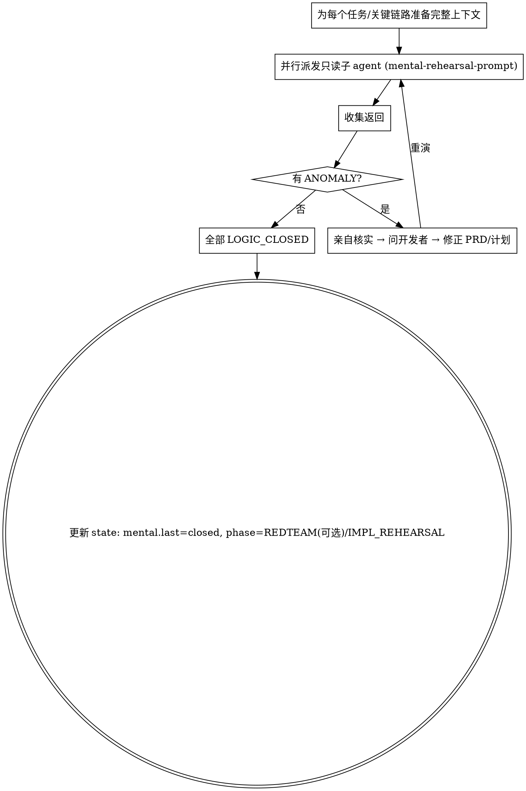

# 头脑预演 · 逻辑推演（只读，不改代码）

**核心：在不写一行代码的前提下，把整条逻辑链路从头到尾推一遍，验证它真的闭环、通畅、没有漏洞、没有意料之外的影响。** 这是用思考成本提前暴露问题，比实现预演更便宜。

**开始时声明：** "我在用 mental-rehearsal 做头脑预演。"

## 它做什么 / 不做什么

- **做**：读计划、PRD、相关代码和文档；按真实调用路径逐步推演数据流、控制流、状态变化、边界与异常路径；核对是否违反 MUST/MUST-NOT；判断逻辑是否闭环。
- **不做**：不改任何代码、不创建文件、不跑会产生副作用的命令。纯只读推理。
- **不将就、不兜底、不节外生枝**：遵循 Karpathy 原则。发现计划没覆盖且会影响 PRD/plan/code reality 闭环、验收、实现可行性或关键决策时，必须作为 ANOMALY 上报；与当前需求无关且不影响决策的边缘疑问记录为残余风险。

## 两条铁律

1. **发现与计划不符、意料之外或新发现，且会影响 PRD/plan/code reality 闭环、验收、实现可行性或关键决策时，立即终止推演并返回 `ANOMALY_FOUND`。关键事实无法确认且影响链路/验收/决策时必须上报；无关边缘疑问记录为残余风险。
2. **在隔离子 agent 中进行，可并行派发多个**（不同视角/不同子模块各一个，或多个同任务交叉验证）。

## 编排（主 agent 做的事）

- 主 agent **不要轻信**子 agent 的"逻辑闭环"结论：抽查它给的推理链与引用是否真实存在。
- 每轮把结果写入 `rehearsals/mental-<n>.md`，并在 `journal.md` 追加一条。

## 子 agent 返回格式（强制）

- `LOGIC_CLOSED` — 推理链完整、闭环、无漏洞。附：①端到端逻辑链（步骤+引用 file:line）②已检查的边界/异常路径 ③与 MUST/MUST-NOT 的核对结论 ④残余风险（P2/P3，如有）。
- `ANOMALY_FOUND` — 附：具体偏差是什么、在计划/代码的哪一处、为什么是问题、影响范围、**问题分级（P0–P3，按 `using-sandtable` 的分级口径）**、它需要哪种澄清。**只有 P0/P1 才返回 `ANOMALY_FOUND` 驱动循环；P2/P3 随 `LOGIC_CLOSED` 作为残余风险列出。**
- 子 agent 派发模板见 `./mental-rehearsal-prompt.md`。

## Red Flags

| 念头 | 现实 |
|------|------|
| "推到一半发现计划漏了个情况，我补个兜底继续" | 立即 ANOMALY 上报。不脑补。 |
| "这条异常路径大概不会走到" | 关键事实没确认且会影响链路/验收/计划决策时上报；无关且不影响决策的边缘疑问记为残余风险。 |
| "子 agent 说闭环了，那就过" | 抽查它的引用与推理。不轻信。 |
| "一个子 agent 推所有链路更省" | 拆分独立链路并行，视角更聚焦。 |
| "发现一堆问题，逐条上报修" | 先按 P0–P3 分级；只有 P0/P1 驱动循环，P2/P3 记残余风险。问题成堆先怀疑方案。 |

## 问题分级与克制

发现的问题一律按 `using-sandtable` 的 **P0–P3 分级口径**（触发概率 × 功能影响 × 可恢复性 × 用户感知）裁决：

- **只有 P0/P1**（必现/大概率且核心受损·违反红线·难自救，或小概率但后果严重）才作为 `ANOMALY_FOUND` 驱动修正循环。
- **P2/P3**（边缘场景、可重试/可自动救回、用户基本无感）作为**残余风险**随 `LOGIC_CLOSED` 列出，交开发者拍板，不自动拉起重演。
- 不为追求逻辑完美构造无现实触发路径、与本需求无关的偏题场景（`being-truthful` 不猜测原则不变：关键未知不能带着继续）。
- 一轮冒出大量 P0/P1 → 先怀疑**方案本身**，回 PLAN/OBJECTIVES 重审，别逐条打补丁。
- 结论用人话向开发者解释：发现什么、定几级、对用户的真实影响、建议怎么办。

## PRD 确认门禁

- 若 `prd.md` 已存在但无可核实开发者确认记录，不得派发 mental 子 agent；同条消息确认 PRD 时，必须在派发前或同时把确认证据持久化到 `state.md` 或 `journal.md`。
