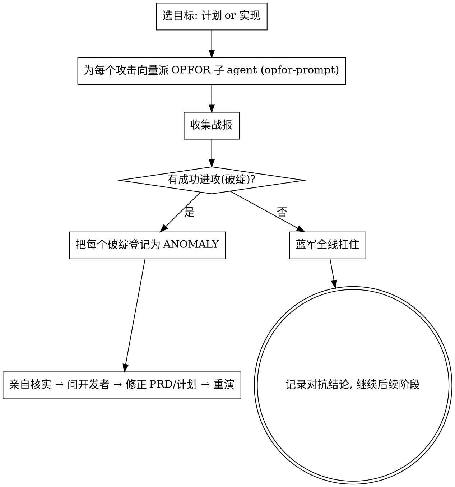

# 红蓝对抗 · OPFOR Wargame（让"敌军"来击溃你的计划）

**军事原则：你想不到的破绽，对手会替你找到。** 普通评审是"友军检查"，容易手下留情；红蓝对抗是**敌我对抗**——红军（OPFOR）的使命是寻找真实、相关、可复现的攻破场景来检验当前计划/实现。蓝军（你的方案）必须扛住所有进攻才算合格。**每一次成功的进攻 = 一个 ANOMALY，喂给修正循环。**

**开始时声明：** "我在用 red-team-wargame 发起红蓝对抗。"

## 什么时候打

- **对计划打**：头脑预演后、实现预演前。攻击"计划本身"——逻辑、假设、覆盖面。
- **对实现打**：实现预演 DONE 后、复盘择优前。攻击"做出来的代码"——边界、并发、回归、越界。
- 可任选其一或都打。脑洞越大的需求越该打。

## 红军的进攻向量（OPFOR 攻击面）

给每个红军子 agent 指定一个或多个攻击向量，要求真实可复现地进攻：

| 进攻向量 | 红军要找的"杀招" |
|---------|------------------|
| **反例攻击** | 构造一个让方案给出错误结果/崩溃的具体输入或场景 |
| **边界突袭** | 空/超大/并发/乱序/重复/超时/网络抖动等极端条件 |
| **假设斩首** | 找出计划里没说出口的隐含假设，证明它不成立 |
| **侧翼包抄** | 隐藏耦合：改动会波及哪个没人注意的上下游 |
| **红线渗透** | 找出方案在某条路径下悄悄违反了某条 MUST / MUST-NOT |
| **回归伏击** | 这个改动会打破哪个现有功能/测试 |
| **范围蔓延** | 揪出未被要求的兜底/灵活性/节外生枝（越界即破绽） |
| **需求背离** | 做的东西其实没满足 PRD 的某条验收标准 |
| **教训复盘** | **若存在** `docs/sandtable/lessons.md`，拿命中过的历史教训作为本轮攻击向量复打（过去逃逸的 bug 优先复攻） |

## 编排（主 agent = 蓝军指挥）

## 裁决规则（防止"假胜利"）

- 红军必须**给出真实、相关、可复现的杀招**（具体输入/场景/步骤 + 可观察错误或证据）。空泛风险、纯猜测、无现实触发路径、与本需求验收无关的脑洞不算 `BREACH_FOUND`。
- 每个杀招按 `using-sandtable` 的 **P0–P3** 分级（触发概率 × 功能影响 × 可恢复性 × 用户感知）。**只有 P0/P1 才作为 `BREACH_FOUND` 驱动修正循环**（违反 MUST/MUST-NOT 直接按 P0/P1 处理）；P2/P3（边缘、可重试/可自动救回、用户基本无感）记为**残余风险**随 `HELD` 返回，交开发者拍板。
- 主 agent（蓝军）**亲自核实每个杀招是否真成立**，不轻信红军也不轻信蓝军。
- 红军"没找到破绽"不等于安全——记录它打了哪些向量、为何没破，作为信心依据。
- **一轮打出大量 P0/P1 → 先怀疑方案本身**，回 PLAN/OBJECTIVES 重审，而不是逐条堵漏。
- 每轮对抗写入 `rehearsals/redteam-<n>.md`，journal 追加。state 的 `rehearsals.redteam` 计数。结论用人话向开发者讲清：打了什么、破了几处、各几级、对用户的真实影响、建议怎么办。

## 三类推演的位置

红蓝对抗是"对抗式推演"，和头脑预演、实现预演三位一体：
- 头脑预演问"逻辑通不通"；
- 红蓝对抗问"能不能被打破"；
- 实现预演问"做出来对不对"。
任一暴露异常，都走同一条 **核实 → 问开发者 → 修正 → 重演** 循环。

## Red Flags

| 念头 | 现实 |
|------|------|
| "红军没找到大问题，差不多得了" | 让红军换个攻击向量再打一轮，尤其红线渗透/侧翼包抄。 |
| "红军说有风险，但没给复现" | 不算破绽。要求可复现杀招，否则驳回。 |
| "这破绽很小，记下来以后改" | 按 P0–P3 分级：P0/P1 进循环；P2/P3 记残余风险交开发者，别强行打磨。 |
| "蓝军自己说扛住了" | 主 agent 亲自核实杀招是否成立。 |
| "破绽一大堆，逐条堵" | 成堆 P0/P1 先怀疑方案，回 PLAN/OBJECTIVES，别逐条打补丁。 |

子 agent 派发模板见 `./opfor-prompt.md`。

## PRD 确认门禁

- 若 `prd.md` 已存在但无可核实开发者确认记录，不得派发红军；同条消息确认 PRD 时，必须在派发前或同时持久化确认证据到 `state.md` 或 `journal.md`。
