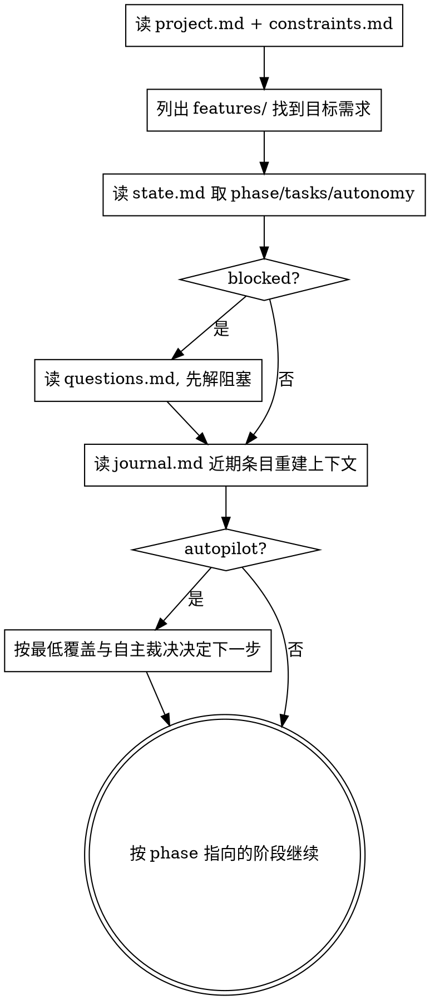

# 状态与记忆 · 换人换 AI 可续

**核心原则：过程不靠对话上下文，靠文件。** 对话会丢、AI 会换、人会换；只要 `docs/sandtable/` 在，任何人/AI 都能接着干。

## 目录结构（在目标项目根创建）

```
docs/sandtable/
  project.md                       # 北极星: 项目目标/背景/范围 (全局, 唯一)
  constraints.md                   # 全局红线: MUST / MUST-NOT (全局, 唯一)
  lessons.md                       # 全局教训台账, 跨 feature 累积 (见 triaging-feedback)
  features/
    <YYYY-MM-DD>-<slug>/           # 一个需求一个目录
      prd.md                       # 需求/目标/验收/红线 (见 writing-prd)
      tests.md                     # 测试用例 (见 writing-tests)
      plan.md                      # 改动计划, 任务带 checkbox (见 writing-plan)
      state.md                     # 状态机: 当前阶段 + 任务状态 (本 skill)
      journal.md                   # 追加式记忆: 决策/问答/推演结果, 只增不改
      questions.md                 # 待开发者澄清的阻塞问题
      feedback.md                  # 验收反馈台账 (见 triaging-feedback; 落地后才有)
      rehearsals/
        mental-<n>.md              # 头脑预演报告
        redteam-<n>.md             # 红蓝对抗战报
        impl-<n>-<branch>.md       # 实现预演报告 + 评分
```

> 注：bugfix 采集的日志原文**不**入库（常含密钥/PII），落仓库外/临时目录；`feedback.md` 只记摘录+行号。
> FEEDBACK 阶段：DONE 后用户验收反馈进入；缺陷类经 bugfix 根因→修复→回归→教训，教训累积进全局 `lessons.md`。FEEDBACK 人在环，autopilot 不驱动。

模板见本插件 `templates/`，可直接拷贝改名。

## state.md：唯一可信的进度

`state.md` 用 YAML frontmatter 存机器可读状态，正文存人类可读摘要：

```markdown
---
feature: 2026-06-01-user-login
phase: PLAN            # INTAKE|RECON|OBJECTIVES|TESTCASES|PLAN|MENTAL_REHEARSAL|REDTEAM|IMPL_REHEARSAL|EVALUATE|INTEGRATE|VERIFY|DONE|FEEDBACK
blocked: false         # true 时必须在 questions.md 有对应阻塞问题
updated: 2026-06-01T23:00:00+08:00
tasks:
  - id: T1
    title: 登录表单组件
    status: todo       # todo|doing|rehearsed|integrated|verified|done
  - id: T2
    title: 鉴权接口对接
    status: todo
rehearsals:
  mental:  { runs: 0, last: none }     # 报告汇总：none|closed|anomaly
  redteam: { runs: 0, last: none }     # 报告汇总：none|held|breach
  impl:    { runs: 0, last: none }     # 报告汇总：none|done|anomaly|blocked
autonomy:
  mode: manual                         # manual|autopilot；是否处于自动模式的唯一权威开关
  min_rounds: { mental: 1, redteam: 1, impl: 1 } # minimum coverage / 最低覆盖
  min_agents_per_round: { mental: 1, redteam: 1, impl: 1 } # minimum coverage / 最低覆盖
  completed_rounds: { mental: 0, redteam: 0, impl: 0 }
  last_decision: none                  # 最近一次自动推进 / 回退重演 / 阻塞裁决
selected_impl: none
---

## 当前进展
（一两句话：现在在哪一步，下一步要做什么）

## 关键决策（最近）
（指向 journal.md 的近期要点）
```

**规则：**
- 每完成一个动作就更新 `state.md` 的 `phase`/`tasks`/`updated`；自动模式下还必须同步刷新 `autonomy.last_decision`，必要时更新 `autonomy.completed_rounds`。
- `blocked: true` 时，主流程暂停，必须先解决 `questions.md` 里的阻塞问题。
- `autonomy.mode` 是自动模式的唯一权威开关；不要再额外发明 `enabled` 一类并列字段。
- 自动模式运行时，`autonomy.*` 是恢复与续跑的权威；不要只看 `rehearsals.runs` 的汇总数字。
- `phase` 在 autopilot 下是记录位；恢复与续跑时，先判断 `autonomy.completed_rounds` 是否满足 `autonomy.min_rounds` 的最低覆盖与自主裁决，再决定下一步阶段。
- 手动 `/sandtable-mental`、`/sandtable-redteam`、`/sandtable-live`、`/sandtable-rehearse` 仍会更新 `rehearsals.*.runs` / `rehearsals.*.last` 与报告文件，但这些手动记录不能抵扣或回填 `autonomy.completed_rounds`。
- 状态回退（异常→修正）时，把 `phase` 改回最早尚未重新验证的阶段，并在 `journal.md` 记录原因；若是 autopilot，还要同步刷新 `autonomy.last_decision`。
- 遇到老需求目录缺少 `autonomy` 块时，显式按 `manual` 处理，并按 `phase` 恢复；不要用 `rehearsals.*` 反推 autopilot 配额进度。

## journal.md：只增不改的记忆

每条记录格式：
```
## 2026-06-01 23:10 · [决策|问答|推演|对抗|异常|集成]
- 背景: ...
- 内容: ...
- 依据/来源: file:line 或 开发者答复
```
**永远不要删改历史条目**——这是换人换 AI 后重建理解的依据。

## 相关技能

- `closing-the-loop` — 回合收尾：战况、可复制模版、AskQuestion 纪律（见 `skills/closing-the-loop/SKILL.md`）

## 恢复流程（/sandtable-resume 的内核）



恢复时**不要重新发明已有决策**——journal 里记过的就按记的来；只在发现矛盾或缺失时才回到 `being-truthful` 去澄清。

自动模式续跑时用这条明确分支，不要写成含糊回退简写：
1. 若 `blocked=true`：先解 `questions.md`。
1.5 **若 `phase` ∈ {`DONE`, `FEEDBACK`}（落地后）**：autopilot 最低覆盖与自主裁决**不适用**，一律**按 `phase` 恢复**；`FEEDBACK` 是人在环阶段，autopilot 不驱动，**不得**因三类配额已达标而被误路由回 `EVALUATE`（由 `/sandtable-bug`、`/sandtable-bugfix` 手动推进）。
2. 若 `autonomy.mode=autopilot` 且 `blocked=false`（且未命中 1.5）：
   - 若 `completed_rounds.mental < min_rounds.mental`，下一步是 `MENTAL_REHEARSAL`；
   - 否则若 `completed_rounds.redteam < min_rounds.redteam`，下一步是 `REDTEAM`；
   - 否则若 `completed_rounds.impl < min_rounds.impl`，下一步是 `IMPL_REHEARSAL`；
   - 否则下一步是 `EVALUATE`。
3. 若 `autonomy.mode=manual`，按 `phase` 恢复。

## Red Flags

| 念头 | 现实 |
|------|------|
| "进度我记在脑子里就行" | 你会被换掉/上下文会丢。写进 state.md。 |
| "journal 太啰嗦，跳过" | 没有 journal，下一个 AI 等于从零开始。 |
| "直接改 journal 旧条目修正一下" | 历史只增不改，修正用新条目。 |
| "blocked 了我先往下做别的" | blocked=主流程停。先解 questions.md。 |

## 最低覆盖、自主裁决与续接门禁

**必须完整读取并逐条遵循 `skills/_shared/autopilot-coverage.md`（最低覆盖、自主裁决与续接门禁），不得跳过或凭记忆简写。**
