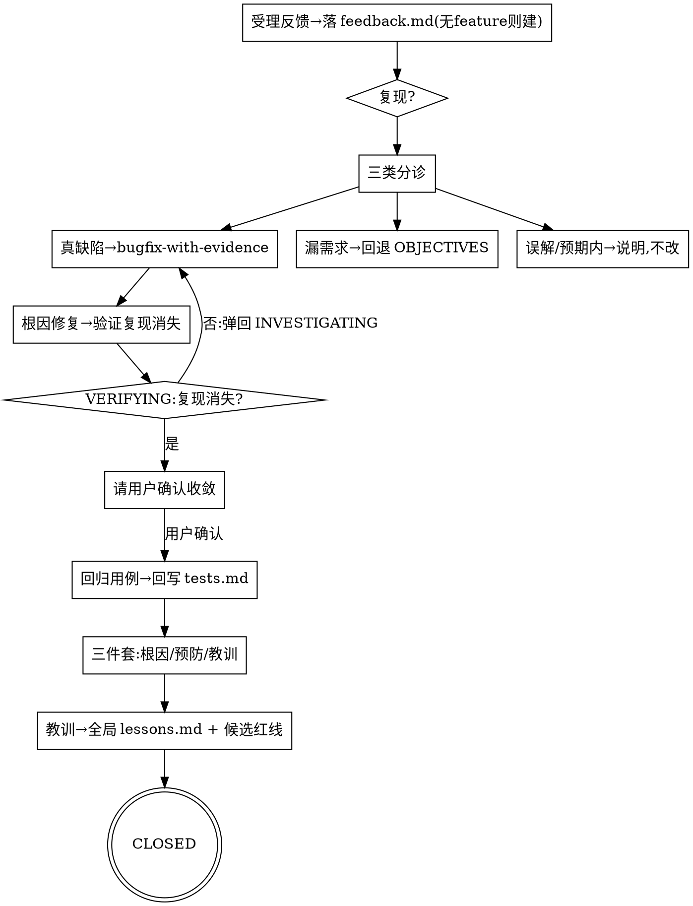

# 验收反馈分诊 · 把逃逸的 bug 变成方法论的加固

**核心立场：每条逃逸到验收的 bug = 一处推演盲区。** 修它的同时必须回答"为什么三类推演没逮到它"，把答案变成回归用例 + 教训——让 Sandtable 用 bug 反哺自己。

**开始时声明：** "我在用 triaging-feedback 做验收反馈分诊。"

<HARD-GATE>
1. 受理的反馈必须先落 `docs/sandtable/features/<id>/feedback.md`（一条一节），再处理；不得口头处理不留痕。**无 feature 兜底**：若反馈针对的代码没有对应 feature 目录，先自动新建轻量 feature `<date>-bugfix-<slug>`（最小 state/feedback），复用 sandtable-init 幂等逻辑、不覆盖已有内容。
2. **分诊为三类之一**，结论标来源（`file:line` 或 PRD 条目），不凭空判定：
   - **真缺陷**：行为与已确认需求不符 → **必须**转 `bugfix-with-evidence` 找根因，禁止跳过根因直接改。
   - **漏需求**：需求当初没覆盖 → 回退 `OBJECTIVES`，按 `writing-prd`/`writing-tests` 补 PRD 与用例，不当 bug 直接改。
   - **误解 / 预期内**：行为符合需求或为理解偏差 → 说明原因与依据，不改代码。
3. **生命周期**：每条反馈带显式状态 `OPEN → TRIAGED → INVESTIGATING(可反复) → ROOT_CAUSED → FIXING → VERIFYING → USER_CONFIRMED → CLOSED`；排查是**反复**过程，VERIFYING 未过弹回 INVESTIGATING；**未经用户确认收敛，不得置 USER_CONFIRMED/CLOSED**（不得 agent 自行宣布"已解决"而关闭）。
4. 缺陷类修复闭合后**必须**产出：(a) 回归用例追加到该 feature `tests.md`（不另起台账）；(b) **关闭三件套**——根因（因果链+证据）、**怎么预防**（流程/红线/检查项层面，非"以后小心"）、**吸取的教训**（一句可复用经验）；缺任一项不得 CLOSED。
5. **教训沉淀**：关闭时把教训追加到**全局** `docs/sandtable/lessons.md`（不存在则按 `templates/lessons.md` 创建），并向开发者提出对 `constraints.md`（新红线）/ RECON 清单（新检查项）的**候选更新**；是否采纳由开发者拍板，**不擅自**改 `constraints.md`。
</HARD-GATE>

## FEEDBACK 是人在环阶段

`autopilot` **不驱动** FEEDBACK（其强制范围止于 `EVALUATE/DONE`，见 `autonomous-orchestration`）；FEEDBACK 仅由 `/sandtable-bug`、`/sandtable-bugfix` 手动进入；"等待用户确认收敛"是合法停点。恢复/续跑时 `phase=FEEDBACK` 按 phase 恢复，不参与 autopilot 配额闭包，不得被误路由回 `EVALUATE`。

## 分诊与生命周期流程

## 与状态机的关系
- 受理反馈时把 `state.md` 的 `phase` 置为 `FEEDBACK`（战后讲评），`updated` 刷新，journal 追加 `[反馈]`。
- 缺陷修复涉及代码改动时，按需回退 `PLAN`（实现缺陷）或 `OBJECTIVES`（漏需求）走最短闭环，再回 `VERIFY` 确认，最后回 `FEEDBACK`/`DONE`。

## Red Flags
| 念头 | 现实 |
|------|------|
| "小 bug 直接改了就行" | 缺陷类必经根因（bugfix-with-evidence），否则可能表面修复。 |
| "修好就关掉" | 未经用户确认收敛不得关闭；不产出预防+教训=浪费这次反哺。 |
| "这反馈其实是漏需求，我顺手补段代码" | 漏需求回退 OBJECTIVES 补 PRD/用例，不当 bug 直接改。 |
| "自动模式顺手把反馈也关了" | FEEDBACK 人在环，autopilot 不驱动，等用户确认。 |

完成后加载 `skills/closing-the-loop/SKILL.md` 输出回合收尾。
