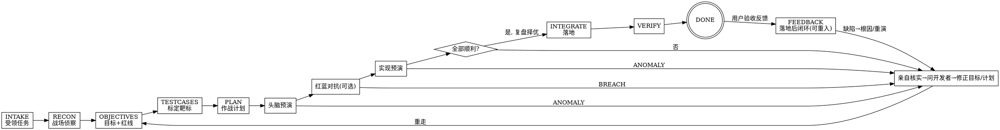

<SUBAGENT-STOP>
若你是被派发来执行某个具体任务（头脑预演 / 红蓝对抗 / 实现预演 / 评审）的子 agent，跳过本技能，直接执行你收到的任务 prompt。
</SUBAGENT-STOP>

# Sandtable · 沙盘推演驱动开发

把一句简单描述或一份粗糙需求，做成开发者**真正想要**的功能——逻辑闭环、产品闭环、细节完美。手段是一个不断加固的循环：**计划 → 推演 → 发现问题 → 修正计划 → 再推演**。

> **术语**：本文"推演"是统称，包含三类——**头脑预演**（只读推逻辑）、**红蓝对抗**（红军专攻找破绽）、**实现预演**（隔离 worktree 真改代码）。

<EXTREMELY-IMPORTANT>
只要有 1% 的可能某个 sub-skill 适用于你当前的动作，你就必须读取并遵循它。你无法用"这次很简单""我先看看代码""这只是个问题"把自己合理化出流程之外。违反规则的字面，就是违反规则的精神。
</EXTREMELY-IMPORTANT>

## 优先级

1. **用户的显式指令**（本条最高）——用户说"跳过流程/直接改"，照做，但提醒风险。
2. **Sandtable 方法论**——覆盖默认行为。
3. **默认系统行为**——最低。

## 核心闭环（状态机）

| 阶段(phase) | 军事隐喻 | 做什么 | 加载的 skill | 命令 |
|------|------|--------|-------------|------|
| INTAKE | 受领任务 | 捕获原始需求（一句话/产品文档），建目录 | `state-and-memory` | `/sandtable-start` |
| RECON | 战场侦察 | 主动收集代码/文档情报，列未知，提问 | `gathering-intel` | `/sandtable-recon` |
| OBJECTIVES | 指挥官意图 | 定目标、MUST/MUST-NOT、红线、验收 | `writing-prd` | `/sandtable-objectives` |
| TESTCASES | 标定靶标 | 把成功定义具体化为黑盒用例,检验理解 | `writing-tests` | （并入 /objectives, /refine 迭代）|
| PLAN | 作战计划 | 写细到可执行的改动计划 | `writing-plan` | `/sandtable-plan` |
| （任意阶段）| 调整部署 | 据反馈反复修改/重制目标/用例或计划 | `writing-prd`/`writing-tests`/`writing-plan` | `/sandtable-refine` |
| MENTAL_REHEARSAL | 图上作业 | 只读子 agent 推演逻辑闭环 | `mental-rehearsal` | `/sandtable-mental` |
| REDTEAM | 红蓝对抗 | 红军子 agent 专攻找破绽（可选，强烈推荐）| `red-team-wargame` | `/sandtable-redteam` |
| IMPL_REHEARSAL | 实兵演习 | 子 agent 在隔离 worktree 真改代码 | `implementation-rehearsal` | `/sandtable-live` |
| EVALUATE | 战损复盘 | 全部顺利则打分择优 | `evaluating-rehearsals` | `/sandtable-debrief` |
| INTEGRATE | 落地 | 把选定实现落到主分支 | — | — |
| VERIFY | 战果确认 | 跑测试/验收，确认成功标准 | `being-truthful` | — |
| FEEDBACK | 战后讲评 | 受理验收反馈,分诊,缺陷转 bugfix 根因(日志100%),回归+教训沉淀 | `triaging-feedback` / `bugfix-with-evidence` | `/sandtable-bug` `/sandtable-bugfix` |
| （随时）| 战报/接防 | 看状态 / 新 AI 重获记忆继续 | `state-and-memory` | `/sandtable-status` `/sandtable-resume` |

每个阶段都有独立命令，可单独触发、反复迭代，无需一次跑完。`/sandtable-start` 负责前五步，`/sandtable-rehearse` 只负责推演与复盘，不是需求入口；若开发者要求 AI 自主连续推进，使用 `/sandtable-autopilot`。

补充说明：
- `/sandtable-start`：只负责 `INTAKE → RECON → OBJECTIVES → TESTCASES → PLAN`。
- `/sandtable-rehearse`：只负责 `MENTAL_REHEARSAL → REDTEAM → IMPL_REHEARSAL → EVALUATE`。
- `/sandtable-autopilot`：在当前回合显式启用自动模式，覆盖从需求输入到复盘择优的无人值守推进。
- **落地后闭环（FEEDBACK）**：DONE 后用户验收反馈进入，由 `/sandtable-bug`（受理分诊）与 `/sandtable-bugfix`（证据驱动根因，**必靠日志100%**）手动推进；缺陷修复后产出回归用例 + 根因/预防/教训三件套，教训累积进全局 `lessons.md` 反哺未来 RECON/红军/PRD。**FEEDBACK 人在环，autopilot 不驱动**（autopilot 范围止于 EVALUATE/DONE）。

## 三类推演各问一个问题

- **头脑预演**：逻辑通不通？（只读推演整条链路是否闭环）
- **红蓝对抗**：能不能被打破？（红军寻找真实可复现破口，验证方案是否能被打破）
- **实现预演**：做出来对不对？（隔离 worktree 真打一遍）

## 推演铁律（两条，三类推演通用）

1. **任一推演只要发现与计划不符、意料之外、或之前没注意到的事，立即终止并上报。** 禁止"顺手改一下继续跑"。这种发现恰恰是流程的价值所在。
2. **推演在隔离子 agent 中进行，可并行多个。** 其中实现预演必须各自独立 git worktree/分支。

## 异常 → 修正 → 重演（系统的心脏）

只要任何推演返回 `ANOMALY_FOUND` / `BREACH_FOUND`（或复盘发现意料之外）：
1. 主 agent **亲自核实**（读相关代码/文档，不轻信子 agent），用客观逻辑判断。
2. 给出**合理方案**；若仍不确定或属于产品决策，**向开发者提问/索要补充**，记入 `questions.md`。
3. 把澄清结论写回 `prd.md` / `tests.md` / `plan.md`，并在 `journal.md` 追加决策记录。
4. **重新推演**，循环直到全部顺利。之后用 `evaluating-rehearsals` 给各实现预演打分，选最高的落地。

## 回合收尾（Sandtable 工作步结束时）

仅当本回合为 **Sandtable 工作步**（正触发见 `closing-the-loop` FR8）时，加载 `skills/closing-the-loop/SKILL.md` 并输出收尾。非 Sandtable 任务（如修 typo）**禁止**收尾，即使读过 `docs/sandtable/`。手动多分支用 AskQuestion；autopilot 非阻塞用战报收尾并同命令续跑。

## 触发规则（Red Flags = 你正在合理化）

| 念头 | 现实 |
|------|------|
| "这个需求太简单，不用走流程" | 简单需求流程可以很短，但必须走。 |
| "我先直接改代码看看" | 先写/确认 PRD 与计划，再推演，再改。 |
| "这个细节我猜应该是…" | 不猜。读代码/文档/问开发者，见 `being-truthful`。 |
| "推演发现点小问题，我顺手修了继续" | 立即终止上报。小问题常是逻辑漏洞的征兆。 |
| "在一个工作区跑多个实现预演更快" | 会互相污染。每个实现预演独立 worktree。 |
| "我记得这套流程，不用读 skill" | skill 会演进，按需读当前版本。 |
| "加个兜底/灵活性更稳" | 不做未要求的兜底，不节外生枝（外科手术式改动）。 |

## 在不同工具里触发

同一套能力，触发方式按工具不同：

- **Cursor / Claude Code / Kiro**：用 `/sandtable-*` 斜杠命令（或把命令名当普通消息发给 AI）。命令是薄入口，会加载上表对应的 skill。
- **Codex**：插件只暴露 **skills**（用 `$技能名` 触发，不是 `/`）。入口是 `$using-sandtable`——它讲清整条状态机并按需加载子 skill；移动端用 `$mobile-companion`。Codex 不通过插件提供 `/sandtable-*` 斜杠命令。

命令（动作入口）与 skill（方法论知识）是多对多关系：一个命令加载一个或多个 skill，部分 skill（`being-truthful`/`closing-the-loop`）无独立命令。

## Mobile Review Companion（可选）

> 完整操作见 `mobile-companion` skill（Codex 用 `$mobile-companion`）。

若当前项目显式启用了 Sandtable mobile review runtime，主 agent 在完成阶段性动作后应同步当前 feature 状态，并保持 agent 流水线处于工作态，直到收到电脑端 stop、stop mailbox event 或开发者明确停止请求。

- 支持 MCP 时，优先调用 Sandtable MCP handler 同步 phase、文档摘要、待确认事项和阻塞状态。
- 不支持 MCP 时，按 `docs/mobile-review-companion/protocol.md` 写入 `.sandtable-runtime/mailbox/inbox/`。
- 主 agent 阶段性动作结束前必须刷新 `.sandtable-runtime/session/continuation.json`，并把等待信箱职责交给一个或一组低成本/免费 waiting workers。
- waiting workers 只能等待、去重、续租、通知、接力或停止；除非被明确分配职责，不得自行修改 PRD/tests/plan 或替主 agent 做产品裁决。
- 未显式启用 runtime 时，不启动 server、不写 mailbox、不改变 Sandtable 默认流程。

## 与既有方法论的关系

Sandtable 吸收了 Karpathy 的四原则（不猜测、极简、外科手术式、目标驱动）与 superpowers 的子 agent 编排思想，新增了**三类推演（头脑预演/红蓝对抗/实现预演）+ 持久状态机 + 异常驱动的修正循环**。若项目已装 superpowers，可在 INTEGRATE/VERIFY 阶段复用其 `test-driven-development`、`requesting-code-review`、`finishing-a-development-branch`。

## 问题分级与克制 · P0–P3（推演的共同裁决口径）

**必须完整读取并逐条遵循 `skills/_shared/issue-grading.md`（P0–P3 分级口径与裁决铁律），不得跳过或凭记忆简写。**

## 推演强度分级 · 按风险裁剪（别用牛刀杀鸡）

不是每个需求都要跑满三类推演。先判复杂度/风险，再定强度——简单的流程可以很短，但**判断本身不能跳过**。

| 任务画像 | 建议强度 |
|---------|---------|
| 文案/常量/单行、无逻辑分支、改动可一眼复核 | 可免推演，直接外科手术式改 + 验证；journal 记一句"低风险免推演"及理由 |
| 单一模块、逻辑清晰、影响面可控 | 至少 1 轮**头脑预演**；按需加红蓝对抗 |
| 跨模块/有并发时序/动数据或接口/影响面不清 | 头脑预演 + 红蓝对抗，必要时实现预演 |
| 高风险（红线相关/数据迁移/安全/不可逆） | 三类推演齐上，可多轮 |

选择"跳过/只做其一/组合"必须在 journal 写明理由。**autopilot（无人值守）保留其最低覆盖底线**（见 `autonomous-orchestration`），强度裁剪主要服务手动流程；trivial 改动建议走手动轻量路径或 `/sandtable-bugfix`，不必拉起 autopilot 全流程。

## PRD 确认门禁与已选择路径直接执行

**开始本动作前，必须完整读取并逐条遵循 `skills/_shared/prd-gate.md`（PRD 确认门禁与已选择路径直接执行），不得跳过或凭记忆简写。**
