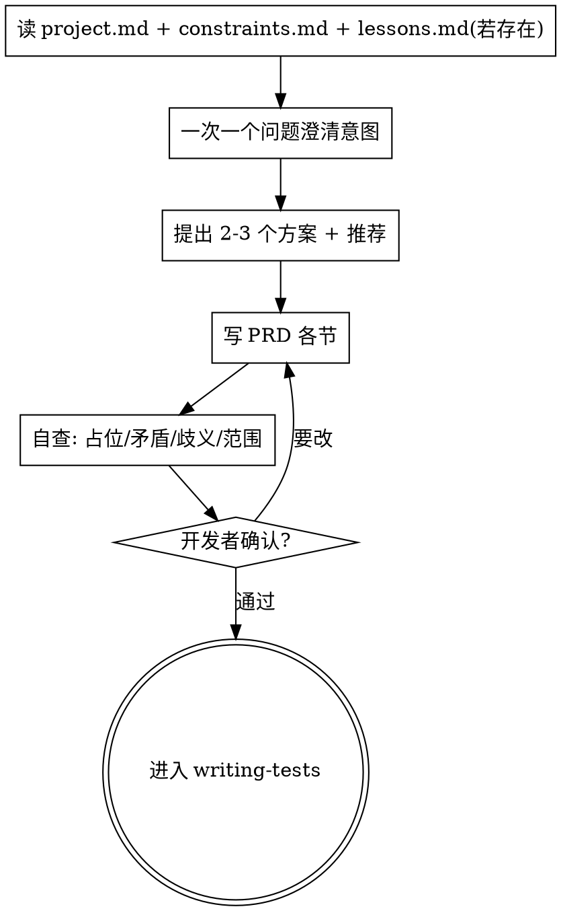

# 写 PRD · 目标、需求、验收、红线

PRD 是这个需求的"事实地基"。它要回答：**为什么做、做成什么样算成功、绝对要做什么、绝对不能做什么。** 实现细节留给计划，不在这里。

**开始时声明：** "我在用 writing-prd 把需求固化为 PRD。"

## 硬门禁

<HARD-GATE>
PRD 写之前，必须先经过侦察（RECON，见 `gathering-intel`）。任何"不确定/缺失"的需求点，按 `being-truthful` 去读代码/文档/问开发者，不允许在 PRD 里发明需求。PRD 完成后必须请开发者确认才能进入 TESTCASES。
</HARD-GATE>

## 流程

## PRD 必含小节

1. **目标**：一句话说清这个需求要为用户达成什么；与 `project.md` 北极星的关系。
2. **背景与现状**：相关代码/模块的事实，标 `file:line`。
3. **用户故事 / 使用场景**：谁、在什么场景、做什么、期望什么结果。
4. **功能需求**：逐条列出，可编号。每条标来源（已确认/待开发者确认）。
5. **验收标准（成功定义）**：§5 只写**抽象成功定义**；具体可演练场景下沉 `tests.md`（见 writing-tests，用例是 AI 理解的具体表现，不强求可执行）。审阅指引：tests.md=理解闸门（先读）、§5=完成闸门（VERIFY 勾选）。
6. **MUST（这个需求绝对要做的）**：硬性要求。
7. **MUST NOT（绝对不能做的）**：边界与红线（含"不做兜底、不节外生枝"），继承 `constraints.md`。
8. **非目标 / 暂不做**：YAGNI，明确砍掉的东西。
9. **未决问题**：指向 `questions.md`。

## 方案探索

在写功能需求前，提出 **2-3 个不同方案**，列权衡，给出推荐项和理由，让开发者选。不要默默选一个。

## 自查（写完后用新眼睛看一遍）

| 检查 | 修法 |
|------|------|
| 占位符（TBD/待定/大概） | 去澄清后补实，或移入 questions.md |
| 内部矛盾（两节冲突） | 改到一致 |
| 歧义（一句话两种解读） | 选一种并写明，必要时问开发者 |
| 范围过大（含多个独立子系统） | 拆成多个需求，各自走流程 |
| 验收不可验证（"做好""能用"） | 改成可测条件 |

## Red Flags

| 念头 | 现实 |
|------|------|
| "需求很清楚，直接写计划" | 没有 PRD 与验收标准，预演无从判定对错。 |
| "PRD 没说的我按常理补" | 不发明需求。缺失要问。 |
| "MUST NOT 是多余的" | 红线缺失，预演就无法识别"越界"这类异常。 |

完成并经开发者确认后，更新 `state.md` 的 phase 为 TESTCASES，加载 `writing-tests`。

## PRD 确认门禁与已选择路径直接执行

**开始本动作前，必须完整读取并逐条遵循 `skills/_shared/prd-gate.md`（PRD 确认门禁与已选择路径直接执行），不得跳过或凭记忆简写。**
